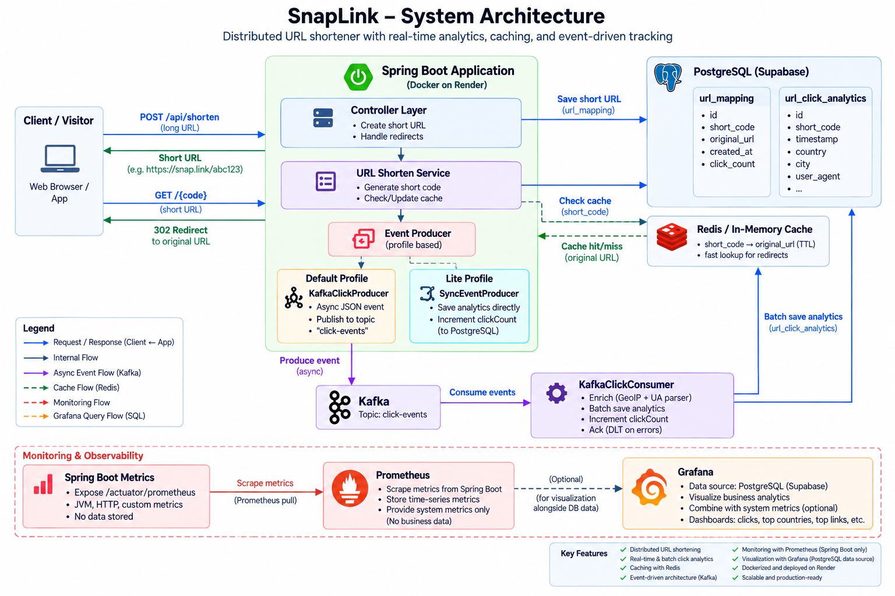

# Snaplink — URL Shortener


**Snaplink** is a production-ready URL shortener built with Spring Boot. It shortens long URLs into compact Base62 codes, supports optional custom aliases and expiration, and captures **rich click analytics** (geographic, device, browser, OS, referrer, hourly breakdowns) through a resilient, event-driven pipeline.

- **Live demo:** <https://url-shortener-app-6ng7.onrender.com/>
- **Source:** <https://github.com/vaibhavGala262/SnapLink>
- **Quality:** SonarCloud — <https://sonarcloud.io/project/overview?id=vaibhavGala262_SnapLink>

---

## Table of Contents

- [Features](#features)
- [Tech Stack](#tech-stack)
- [Architecture & Request Flow](#architecture--request-flow)
- [Directory Structure](#directory-structure)
- [Data Model](#data-model)
- [API Reference](#api-reference)
- [Configuration & Environment Variables](#configuration--environment-variables)
- [Setup Guide (4 ways)](#setup-guide-4-ways)
- [Profiles](#profiles)
- [Testing & Code Coverage](#testing--code-coverage)
- [CI/CD Pipeline](#cicd-pipeline)
- [SonarCloud](#sonarcloud)
- [Deployment: Render](#deployment-render)
- [Database: Supabase](#database-supabase)
- [Free-Tier Operations & Keep-Alive](#free-tier-operations--keep-alive)
- [Performance Tuning](#performance-tuning)
- [Security Notes](#security-notes)
- [Troubleshooting](#troubleshooting)
- [Satellite Docs](#satellite-docs)

---

## Features

- **URL shortening** — cryptographically secure 10-character Base62 codes (`62^10 ≈ 839 quintillion` combinations), with collision detection + retry.
- **Custom aliases** — 3–20 chars (`a-z`, `0-9`, `-`, `_`), case-insensitive, blocked reserved words (`api`, `admin`, `analytics`, …).
- **Smart dedup** — the same URL reuses its existing code instead of generating a duplicate; same alias + same URL returns the existing one.
- **Optional expiry** — links can expire (`expiresAt`), enforced on every lookup (and reflected in cache TTLs).
- **Click analytics** — every redirect records a click enriched with:
  - Country / City (MaxMind **GeoIP2** + `GeoLite2-City.mmdb`)
  - Device type, browser, browser version, OS, OS version (**ua-parser-java**)
  - Referrer, IP address, timestamp
- **Analytics API** — total/recent clicks, breakdowns by country, device, hour (last 24h), and top referrers.
- **Caching** — Redis-backed with transparent in-memory fallback (TTL-aware). Cache-first lookups keep redirects fast.
- **Event-driven click pipeline** — Kafka is the primary path (async, batched, manually acked, with a dead-letter topic); the `lite` profile switches to a simple synchronous path so you can run **without Kafka at all**.
- **Observability** — Actuator (`health`, `metrics`, `prometheus`), SpringDoc OpenAPI/Swagger UI, plus a DB-backed keep-alive health endpoint (`/api/health`).
- **CI/CD** — GitHub Actions runs build, tests, JaCoCo coverage, and SonarCloud on every push to `main`; tag pushes publish GitHub Releases.

## Tech Stack

| Layer        | Technology                                                              |
| ------------ | ----------------------------------------------------------------------- |
| Language     | Java 23                                                                  |
| Framework    | Spring Boot 3.5.4 (Web MVC, JPA/Hibernate, Thymeleaf, Actuator, Redis)  |
| Database     | PostgreSQL 16 (Hibernate `ddl-auto=update`, Hikari connection pool)     |
| Streams      | Apache Kafka (`spring-kafka`, producer + batch consumer + DLT)          |
| Cache        | Redis (`spring-data-redis`) with in-memory fallback                     |
| Analytics    | MaxMind GeoIP2 (`geoip2`), ua-parser-java (`uap-java`)                  |
| API docs     | SpringDoc OpenAPI (`springdoc-openapi-starter-webmvc-ui`)               |
| Metrics      | Micrometer + Prometheus registry                                        |
| UI           | Thymeleaf Server-Side Rendering (templates)                             |
| Build        | Maven (wrapper included), JaCoCo coverage                               |
| Infra/CI     | Docker / Docker Compose, GitHub Actions, SonarCloud, Render, Supabase   |

## Architecture & Request Flow



**Redirect path (hot path):**

1. `GET /{shortCode}` arrives.
2. `UrlShortnerService.getOriginalUrl` checks **cache** first (`url:<code>`); on hit it redirects instantly.
3. On cache miss it queries PostgreSQL, checks expiry, re-warms the cache, then redirects `302`.
4. A click **event** is produced asynchronously (Kafka in `default`, synchronous DB write in `lite`) — redirect latency is never blocked by analytics.

**Click pipeline (analytics path):**

- `ClickEvent` (shortCode, IP, User-Agent, Referer, timestamp) → `eventProducer.sendClickEvent(...)`.
- **default profile:** `KafkaClickProducer` serializes to JSON → topic `click-events`; `KafkaClickConsumer` processes **batches** (manual ack, concurrency 8), enriches each event, `saveAll`s analytics, increments `clickCount`, and dead-letters failures to `<topic>.DLT`.
- **lite profile:** `SyncEventProducer` enriches and saves synchronously inside one transaction.
- Enrichment (`AnalyticsService`) uses GeoIP (country/city) + UA parser (device, browser, OS) with graceful fallbacks to `unknown`.

## Directory Structure

```
Snaplink/
├── .github/workflows/
│   ├── ci.yml                  # Build → Test → SonarCloud → artifact → Render deploy (main push)
│   └── release.yml             # Tag (v*) trigger → build jar → publish GitHub Release
├── .env.example                # Template for local env vars (copy to .env)
├── .gitignore                  # .env, target/, mmdb, IDE files
├── .dockerignore
├── Dockerfile                  # Multi-stage-free Temurin 23 image, builds with Maven wrapper
├── docker-compose.yml          # Full local stack: app + PostgreSQL + Redis + Kafka
├── docker-compose-lite.yml     # Lite local stack: app + PostgreSQL only
├── start-lite.bat              # Windows helper for the lite compose stack
├── render.yml                  # Render blueprint (web service, free plan, lite profile)
├── sonar-project.properties    # SonarCloud configuration
├── SONAR.md                    # SonarCloud setup & reading guide
├── TESTING.md                  # Testing strategy & conventions
├── TESTING_ANNOTATIONS.md      # Annotations walkthrough for the test suite
├── pom.xml                     # Maven build, JaCoCo 0.8.15, ci profile
├── mvnw / mvnw.cmd             # Maven wrapper (Java 23)
└── src/
    ├── main/
    │   ├── java/com/vaibhavgala/url_shortner/
    │   │   ├── UrlShortnerApplication.java      # Entry point (also auto-loads .env via dotenv)
    │   │   ├── config/
    │   │   │   ├── RedisConfig.java             # RedisTemplate (enabled by flag)
    │   │   │   └── KafkaConfig.java             # @EnableKafka + DLT error handler (enabled by flag)
    │   │   ├── controller/
    │   │   │   ├── UrlShortenerController.java  # /api/shorten, /{shortCode} redirect, error handling
    │   │   │   ├── AnalyticsController.java     # /api/analytics/{shortCode}
    │   │   │   ├── HealthController.java        # /api/health (DB-backed keep-alive)
    │   │   │   └── WebController.java           # Thymeleaf pages (/, /analytics)
    │   │   ├── models/
    │   │   │   ├── UrlMapping.java              # Entity: url_mapping
    │   │   │   └── UrlClickAnalytics.java       # Entity: url_click_analytics
    │   │   ├── repo/
    │   │   │   ├── UrlMappingRepository.java    # JPA + incrementClickCountBy
    │   │   │   └── UrlClickAnalyticsRepository.java  # Analytics queries (group by country/device/hour/referrer)
    │   │   └── service/
    │   │       ├── UrlShortnerService.java      # Shorten logic, Base62 gen, expiry, cache-first lookup
    │   │       ├── AnalyticsService.java        # Click enrichment (GeoIP + UA parser)
    │   │       ├── cache/
    │   │       │   ├── CacheService.java        # Interface
    │   │       │   ├── RedisCacheService.java   # Redis impl (default)
    │   │       │   └── InMemoryCacheService.java# ConcurrentHashMap impl (lite)
    │   │       ├── enrichment/
    │   │       │   ├── ClientIPService.java     # Extracts real IP (X-Forwarded-For etc.)
    │   │       │   └── GeoIPService.java        # Country/city from mmdb (graceful "unknown")
    │   │       ├── events/
    │   │       │   ├── EventProducer.java       # Interface
    │   │       │   ├── ClickEvent.java          # Record (shortCode, ip, ua, referer, timestamp)
    │   │       │   └── SyncEventProducer.java   # Lite-path synchronous impl
    │   │       └── kafka/
    │   │           ├── KafkaClickProducer.java  # Async publisher → "click-events"
    │   │           └── KafkaClickConsumer.java  # Batch consumer, manual ack, saves analytics
    │   └── resources/
    │       ├── application.properties           # Default config (Kafka + Redis ON, tuned)
    │       ├── application-lite.properties      # lite profile (Kafka + Redis OFF)
    │       ├── templates/                       # Thymeleaf: index.html, analytics.html
    │       ├── static/                          # main.css, analytics.css, main.js, analytics.js
    │       └── GeoLite2-City.mmdb               # ⚠️ git-ignored — provide your own (license)
    └── test/java/com/vaibhavgala/url_shortner/  # 40 unit tests across controllers/services
```

## Data Model

Tables are created/updated automatically by Hibernate (`spring.jpa.hibernate.ddl-auto=update`).

### `url_mapping`

| Column         | Type                     | Notes                               |
| -------------- | ------------------------ | ----------------------------------- |
| `id`           | BIGSERIAL (PK)           | `IDENTITY`                          |
| `original_url` | TEXT                     | The long target URL                 |
| `short_code`   | VARCHAR (unique, not null) | 10-char Base62 or custom alias    |
| `expires_at`   | TIMESTAMP (nullable)     | Expiry instant (links can be permanent) |
| `click_count`  | BIGINT (default 0)       | Incremented on every click          |
| `created_at`   | TIMESTAMP                | `LocalDateTime.now()`               |

### `url_click_analytics`

| Column           | Type             | Notes                                    |
| ---------------- | ---------------- | ---------------------------------------- |
| `id`             | BIGINT (PK)      | Sequence `url_click_analytics_seq` (allocation 50) |
| `short_code`     | VARCHAR (not null) | Resolved short code                    |
| `timestamp`      | TIMESTAMP        | Click time                              |
| `ip_address`     | VARCHAR          | Client IP (proxy headers preferred)     |
| `user_agent`     | TEXT             | Raw UA string                           |
| `referer`        | VARCHAR          | HTTP Referer                            |
| `country`, `city`| VARCHAR          | From GeoIP (fallback `unknown`)         |
| `device_type`, `browser`, `browser_version`, `os`, `os_version` | VARCHAR | From ua-parser |

## API Reference

| Method | Path                        | Description                                                                 |
| ------ | --------------------------- | --------------------------------------------------------------------------- |
| POST   | `/api/shorten`              | Shorten a URL. Params: `url`, optional `alias`, optional `expiresAt` (ISO-8601 `yyyy-MM-ddTHH:mm:ss`). Returns short URL string. |
| GET    | `/{shortCode}`              | `302` redirect to the original URL (records a click). `404` if missing/expired. |
| GET    | `/api/analytics/{shortCode}`| Analytics JSON: `totalClicks`, `recentClicks` (max 10), `clicksByCountry`, `clicksByDevice`, `clicksByHour` (last 24h), `topReferrers`. |
| GET    | `/api/health`               | DB-backed health: `{"status":"UP","urls":N}`. Used by monitoring/keep-alive. |
| GET    | `/actuator/health`          | Spring Actuator health (includes DB, Redis per config).                     |
| GET    | `/actuator/metrics`         | Micrometer metrics                                                            |
| GET    | `/actuator/prometheus`      | Prometheus scrape endpoint                                                    |
| GET    | `/swagger-ui.html`          | SpringDoc OpenAPI UI                                                          |

**Example — shorten with alias:**

```bash
curl -X POST "http://localhost:8080/api/shorten?url=https://example.com/very/long/path&alias=docs"
```

**Example — shorten with expiry:**

```bash
curl -X POST "http://localhost:8080/api/shorten?url=https://example.com&expiresAt=2030-01-01T00:00:00"
```

## Configuration & Environment Variables

The app reads configuration from environment variables with sensible defaults (`application.properties`). It also auto-loads a **`.env` file** from the working directory on startup (via `dotenv-java` in `UrlShortnerApplication.main` — values become system properties).

| Variable                  | Required | Default          | Purpose                                          |
| ------------------------- | -------- | ---------------- | ------------------------------------------------ |
| `DB_HOST`                 | No       | `localhost`      | PostgreSQL host                                  |
| `DB_PORT`                 | No       | `5432`           | PostgreSQL port                                  |
| `DB_NAME`                 | No       | `snaplink`       | Database name                                    |
| `DATABASE_USERNAME`       | **Yes**  | —                | PostgreSQL user                                  |
| `DATABASE_PASSWORD`       | **Yes**  | —                | PostgreSQL password                              |
| `REDIS_HOST`              | No       | `redis`          | Redis host (Kafka profile)                       |
| `REDIS_PORT`              | No       | `6379`           | Redis port                                       |
| `REDIS_TIMEOUT`           | No       | `2000ms`         | Redis command timeout                            |
| `REDIS_HEALTH_ENABLED`    | No       | `true`           | Redis health indicator (set `false` if no Redis) |
| `KAFKA_BOOTSTRAP_SERVERS` | No       | `localhost:9092` | Kafka broker list (Kafka profile)                |
| `PREFIX_WEBSITE_DOMAIN`   | No       | request host     | Base used to build short URLs (e.g. `http://localhost:8080/`) |
| `GEOIP_DB_PATH`           | No       | classpath        | Path to a `GeoLite2-City.mmdb` outside the jar   |
| `SPRING_PROFILES_ACTIVE`   | No       | —                | `lite` to disable Kafka + Redis                  |

> ⚠️ **`DATABASE_URL` is NOT used.** The app connects via `DB_HOST`/`DB_PORT`/`DB_NAME`/`DATABASE_USERNAME`/`DATABASE_PASSWORD`. (Some older docs mentioned `DATABASE_URL` — ignore those.)

Copy `.env.example` to `.env`, fill the values, and you're ready to run locally.

## Setup Guide (4 ways)

Pick whichever fits your environment.

> **Prerequisites:** Java 23 (for Maven runs) and/or Docker (for containerized runs). Postgres is required everywhere; Redis + Kafka only for the `default` profile.

### A. Lite + Docker (recommended, fastest)

Only PostgreSQL + the app — perfect for a quick local demo. Kafka/Redis stay off.

```bash
docker compose -f docker-compose-lite.yml up --build
```

On Windows you can also just run `start-lite.bat`. Then open <http://localhost:8080>.

### B. Full stack + Docker (Kafka + Redis)

Everything: app, PostgreSQL, Redis, single-node Kafka.

```bash
docker compose up --build
```

> ⚠️ `docker-compose.yml` passes `DATABASE_URL` for legacy reasons but the app ignores it; set `DB_HOST/DB_PORT/DB_NAME` instead.

### C. Manual Maven run

You need a reachable PostgreSQL (and Redis/Kafka for the `default` profile).

**Windows PowerShell:**

```powershell
Copy-Item .env.example .env   # then edit .env with your values
./mvnw.cmd spring-boot:run
```

**macOS / Linux:**

```bash
cp .env.example .env          # then edit .env with your values
./mvnw spring-boot:run
```

Or with an explicit profile:

```bash
# Lite (no Kafka/Redis):
SPRING_PROFILES_ACTIVE=lite ./mvnw spring-boot:run
# Full:
./mvnw spring-boot:run
```

App runs on <http://localhost:8080>. Verify <http://localhost:8080/api/health> → `{"status":"UP","urls":N}`.

### D. Remote database (Supabase / any Postgres)

Point the env vars at a hosted Postgres (this is exactly what the Render deployment does):

```env
DB_HOST=db.<your-ref>.supabase.co
DB_PORT=5432
DB_NAME=postgres
DATABASE_USERNAME=postgres
DATABASE_PASSWORD=<your-db-password>
SPRING_PROFILES_ACTIVE=lite
```

Schemas auto-create via `ddl-auto=update`. Our JDBC URL uses `sslmode=prefer`, which works with Supabase's TLS.

## Profiles

| Profile  | Kafka | Redis | Cache               | Click pipeline    | Use case                          |
| -------- | ----- | ----- | ------------------- | ----------------- | --------------------------------- |
| `default`| ON    | ON    | Redis               | Kafka → batch consumer | Local full-stack / staging    |
| `lite`   | OFF   | OFF   | In-memory           | Synchronous DB    | Free tiers (Render), simple setup |

Flags are plain properties (`app.features.kafka.enabled`, `app.features.redis.enabled`) — override in env if you need a mixed setup.

## Testing & Code Coverage

```bash
# Full test suite (40 tests)
./mvnw test

# CI-equivalent build with coverage + jar (39 tests; excludes the DB-dependent context test)
./mvnw -Pci package
```

- **Test stack:** JUnit 5, Mockito, Spring `@WebMvcTest` (MockMvc) for controllers, plain unit tests for services.
- **Coverage:** JaCoCo `0.8.15` (`prepare-agent` + `report`) — report at `target/site/jacoco/index.html`.
- **Current SonarCloud coverage: 71%** (302 lines to cover).
- See `TESTING.md` and `TESTING_ANNOTATIONS.md` for the testing strategy.

## CI/CD Pipeline

GitHub workflows live in `.github/workflows/`.

### `ci.yml` — on every push / PR to `main`

1. **Init** — `actions/checkout` (full depth) + `actions/setup-java` (Temurin 23, Maven cache).
2. **Build / Test / Package** — `mvn -B -Pci package`.
3. **SonarCloud analysis** — Maven Sonar plugin, pinned to `sonar-maven-plugin:5.8.0.7211`.
4. **Upload jar artifact** — kept 14 days.
5. **Deploy to Render** — guarded: fires the deploy hook only on `main` pushes when the `RENDER_DEPLOY_HOOK` secret exists.

All actions are **SHA-pinned** (with version comments) for supply-chain safety.

### `release.yml` — on any tag push (`v*`)

Builds the jar and publishes a **GitHub Release** with auto-generated release notes + the `.jar` attached. Releases are tag-triggered only (no draft-per-push).

```bash
git tag v0.1.0
git push origin v0.1.0
```

### Repository secrets

| Secret              | Used by          | Purpose                                          |
| ------------------- | ---------------- | ------------------------------------------------ |
| `SONAR_TOKEN`       | `ci.yml`         | SonarCloud auth (org `vaibhavgala262`)           |
| `RENDER_DEPLOY_HOOK`| `ci.yml`         | Render deploy API URL for the web service        |

## SonarCloud

- **Project:** `vaibhavGala262_SnapLink` (org `vaibhavgala262`)
- Configured in `sonar-project.properties` (sources, tests, JaCoCo report paths, exclusions).
- SonarCloud **free plan analyzes only the `main` branch** — branch analyses are not retained.
- Dashboard: <https://sonarcloud.io/project/overview?id=vaibhavGala262_SnapLink>
- Full setup + reading guide: [`SONAR.md`](SONAR.md).

## Deployment: Render

The project ships a **Render Blueprint** (`render.yml`) — a free web service, Docker env, `lite` profile, Supabase DB, health check on `/`.

```yaml
services:
  - type: web
    name: url-shortener-app
    env: docker
    repo: https://github.com/vaibhavgala262/SnapLink.git
    plan: free
    envVars:
      - key: DB_HOST            # e.g. db.<ref>.supabase.co
      - key: DB_PORT            # "5432"
      - key: DB_NAME            # postgres
      - key: DATABASE_USERNAME  # postgres
      - key: SPRING_PROFILES_ACTIVE  # lite
      # DATABASE_PASSWORD: set as a secret in the Render dashboard
    healthCheckPath: /
```

To wire CI → Render: create the service from the blueprint, then copy its **Deploy Hook URL** into GitHub Actions secret `RENDER_DEPLOY_HOOK`. Every green `main` push auto-deploys.

Current live instance: <https://url-shortener-app-6ng7.onrender.com/>

## Database: Supabase

Supabase runs Postgres with a generous free tier, used by the Render deployment:

- **2 projects** per free org, **500 MB DB** per project, 1 GB storage, 5 GB uncached + 5 GB cached egress/month.
- Free projects **pause after ~7 days of low activity** — keep at least a few real DB queries per day flowing.
- You get a warning email ~1 week before a pause, and can resume within **1 year** (data intact). Paid plans never pause.
- **No automated backups on the free tier** — export anything you can't lose.

The app's `/api/health` endpoint performs a live `SELECT COUNT(*)`, which is the cheapest way to keep both Render **and** Supabase from idling (see below).

## Free-Tier Operations & Keep-Alive

Both free tiers punish idle resources — the built-in `/api/health` endpoint solves both with **one** request:

### Render (free web service)
- **15 minutes** idle → service spins down; next request cold-starts in ~30–60s.
- **750 free instance-hours/month** per workspace (shared across all free web services).
- **5 GB** outbound bandwidth/month (then $0.15/GB).
- Keeping a single service warm 24/7 uses ~740 of the 750 hours — fine for one service, means you can't warm two.

### The keep-alive (UptimeRobot)
A free **UptimeRobot** monitor hits `https://url-shortener-app-6ng7.onrender.com/api/health` every **5 minutes**. Each check:

1. Keeps Render awake (15-min spin-down never triggers).
2. Runs a real Supabase query (`SELECT COUNT(*)`), satisfying the DB's activity rule hundreds of times a day.

Alternative free options: cron-job.org, or a GitHub Actions `schedule:` cron workflow — anything that reliably fires at least a few times a day works.

## Performance Tuning

The app ships with production-oriented defaults in `application.properties`:

- **HikariCP:** max 10 connections, min idle 2, leak detection 60s, keep-alive 60s.
- **Hibernate:** batch size 50, `order_inserts`/`order_updates`, `open-in-view=false`.
- **Kafka producer:** idempotent, acks=all, compression `snappy`, batch 32 KB, linger 5ms.
- **Kafka consumer:** batch listener (type `batch`, concurrency 8), 25 max records/poll, manual `manual_immediate` ack, max-poll-interval 120s, DLT on failures.
- **Tomcat:** 300 max threads, 10,000 max connections, tuned timeouts.
- **Prometheus** metrics exported at `/actuator/prometheus`; health details always shown.

## Security Notes

- **Never commit secrets.** `.env` is git-ignored; `DATABASE_PASSWORD` and the Render/Sonar tokens are secrets only.
- If any secret was ever shared in a chat/log, **rotate it** (Supabase password, Render hook key, Sonar token) and update the corresponding secret stores.
- Custom aliases reserve common/admin paths to avoid squatting.
- Short codes are generated with `SecureRandom` (62^10 keyspace) — not guessable.
- Redirects are `302` (client-side tracking preserved), and click events are recorded **after** a lookup, off the request path.

## Troubleshooting

| Symptom                               | Likely cause / fix                                                                                      |
| ------------------------------------- | ------------------------------------------------------------------------------------------------------- |
| 404 on `/api/health` or the site      | Wrong host. Render URLs are `<service>-<suffix>.onrender.com` — use `url-shortener-app-6ng7.onrender.com`, not `url-shortener-app.onrender.com`. |
| `DATABASE_PASSWORD` errors at startup | Required env var missing — add it to `.env`, Docker compose, or Render secrets.                          |
| “GeoIP lookup failed” / `unknown`     | `GeoLite2-City.mmdb` is git-ignored. Add your own file (MaxMind license) to `src/main/resources` or set `GEOIP_DB_PATH`. App degrades gracefully. |
| Kafka errors in `default` profile     | No broker reachable. Either start one via `docker compose up`, or switch to the `lite` profile.          |
| Redis connection warnings             | Expected behavior — `RedisCacheService` catches failures and falls back; Redis health may flip DOWN. Set `REDIS_HEALTH_ENABLED=false` if Redis isn’t used. |
| Slow first request on Render          | Free service cold start after spin-down (~30–60s). Normal.                                               |
| Supabase DB paused                    | No queries for ~7 days — hit `/api/health` periodically (keep-alive monitor). Resume from the dashboard within 1 year. |
| Release workflow didn’t run           | Releases are **tag-triggered** — push a `v*` tag, it won’t run on branch pushes.                         |
| Aliased link won’t save               | Alias fails validation (3–20 chars, `a-z0-9-_`) or is reserved/ taken by a different URL.                |

## Satellite Docs

- [`SONAR.md`](SONAR.md) — SonarCloud project setup, current metrics, and how to read the dashboard.
- [`TESTING.md`](TESTING.md) — testing strategy, conventions, and coverage targets.
- [`TESTING_ANNOTATIONS.md`](TESTING_ANNOTATIONS.md) — annotation-by-annotation walkthrough of the test-suite style.
- [`render.yml`](render.yml) — the Render blueprint used for deployment.
- [`docker-compose.yml`](docker-compose.yml) / [`docker-compose-lite.yml`](docker-compose-lite.yml) — local orchestration.

---

Built with Spring Boot. Deployed on Render, analyzed by SonarCloud, watched by UptimeRobot.